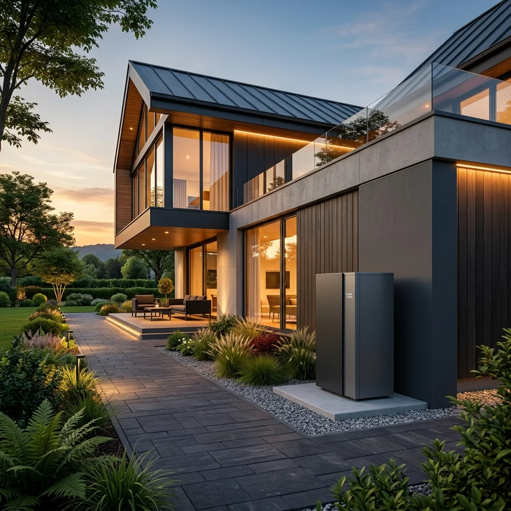
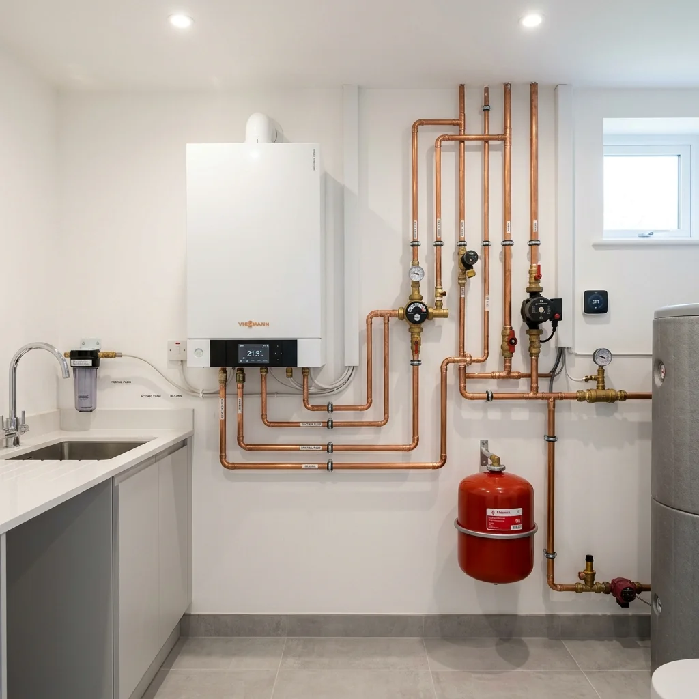

# Ročníková práce: Moderní webová prezentace "H-INSTAL"
**Předmět:** Webové technologie (2. ročník)  
**Autor:** Student (ve spolupráci s AI)  
**Téma:** Instalatérské a topenářské služby – Jan Hruška (H-INSTAL)

---

## 1. Úvod
Tento projekt představuje komplexní, plně optimalizovanou a moderní webovou prezentaci pro instalatérské a topenářské služby pod značkou **H-INSTAL - Jan Hruška**. Web slouží jako digitální vizitka a nástroj pro získávání poptávek. Nabízí přehled služeb (se zaměřením na tepelná čerpadla IVT a plynové kotle), provozní dobu, galerii realizací, sekci FAQ, zákaznické recenze, kontaktní údaje a interaktivní kalkulačku úspor.

* **Živý web (GitHub Pages):** [https://janhruska-git.github.io/topenarstvi-hruska/](https://janhruska-git.github.io/topenarstvi-hruska/)
* **GitHub Repozitář:** [https://github.com/janhruska-git/topenarstvi-hruska](https://github.com/janhruska-git/topenarstvi-hruska)

---

## 2. Použité technologie
Projekt je postaven striktně na čistých webových technologiích bez použití externích CSS nebo JS frameworků, čímž demonstruje hlubokou znalost principů fungování webu „pod kapotou“:

* **HTML5:** Sémantický kód splňující validitu W3C a standardy přístupnosti WCAG 2.1.
* **CSS3:** Custom Properties (proměnné), Flexbox, Grid Layout, CSS animace a přechody, podpora tmavého režimu.
* **Vanilla JavaScript (ES6+):** Logika pro tmavý režim, interaktivní kalkulačku úspor, dynamic filter, validaci formulářů, FAQ akordeon a dotykový recenzní slider.
* **Python (verze 3.13):** Build skript pro automatickou optimalizaci (minifikace CSS/JS, konverze obrázků do WebP).
* **IDE:** VS Code (Visual Studio Code, verze 1.90+).

---

## 3. Adresářová struktura
Rozložení souborů v projektu je navrženo podle osvědčených standardů pro přehlednost a modularitu vývoje:

```text
topenarstvi-hruska-main/
├── index.html                   # Hlavní stránka (sémantika, SEO, strukturovaná data)
├── robots.txt                   # Pokyny pro vyhledávače a roboty
├── sitemap.xml                  # Mapa stránek pro indexaci vyhledávači
├── assets/                      # Statické a dynamické materiály
│   ├── css/
│   │   ├── style.css            # Vývojový (zdrojový) styl s design systémem
│   │   └── style.min.css        # Minifikovaný styl (produkční verze)
│   ├── js/
│   │   ├── main.js              # Vývojový (zdrojový) JavaScript s logikou webu
│   │   └── main.min.js          # Minifikovaný JavaScript (produkční verze)
│   └── img/
│       ├── hruska.png           # Původní logo
│       ├── hruska.webp          # Optimalizované logo (WebP)
│       ├── 35f1.jpeg            # Původní fotografie realizace
│       ├── 35f1.webp            # Optimalizovaná fotografie realizace (WebP)
│       ├── heat_pump.png        # Původní vizuál tepelného čerpadla (generovaný AI)
│       ├── heat_pump.webp       # Optimalizovaný vizuál tepelného čerpadla (WebP)
│       ├── boiler.png           # Původní vizuál plynového kotle (generovaný AI)
│       └── boiler.webp          # Optimalizovaný vizuál plynového kotle (WebP)
├── scripts/
│   └── build.py                 # Python build skript (minifikace & konverze obrázků)
└── README.md                    # Tato komplexní dokumentace
```

---

## 4. Technický rozbor optimalizace

### A. Výkon (Performance)
**Teoretický popis:**  
Rychlost načítání stránky je kritickým faktorem pro udržení uživatele na webu a má přímý dopiv na hodnocení vyhledávači (Core Web Vitals). K dosažení vysokého výkonu jsme implementovali:
1. **Minifikaci kódu:** Odstranění zbytečných mezer, komentářů a konců řádků z CSS a JS souborů pomocí Python skriptu, což snížilo velikost přenášených dat.
2. **Optimalizaci obrázků:** Všechny JPEG a PNG obrázky byly zkomprimovány a převedeny do moderního formátu **WebP**, který nabízí o 50-90 % menší velikost souborů při zachování vysoké kvality.
3. **Lazy Loading:** Obrázky, které se nacházejí mimo počáteční výřez (viewport), se stahují až ve chvíli, kdy se k nim uživatel přiblíží scrolováním (`loading="lazy"`).
4. **Minimalizaci HTTP požadavků:** Použili jsme čisté a optimalizované SVG ikony vložené přímo v kódu (inline SVG), čímž jsme odbourali stahování externích ikonových fontů.

**Výstřižek kódu (Minifikace v `build.py`):**
```python
def minify_css(css_content):
    # Odstranění blokových komentářů
    css = re.sub(r'/\*[\s\S]*?\*/', '', css_content)
    # Odstranění mezer kolem selektorů a vlastností
    css = re.sub(r'\s*([\{\}:;,])\s*', r'\1', css)
    # Sloučení vícenásobných mezer
    css = re.sub(r'\s+', ' ', css)
    return css.strip()
```
*Vysvětlení:* Tato regulární funkce nahrazuje všechny komentáře a nadbytečné mezery v CSS souboru. Ušetřila **25.5 %** velikosti CSS souboru (snížení na 20.1 KB) a **46.0 %** velikosti JS souboru (snížení na 8.3 KB), což urychluje stahování zdrojů z mobilních sítí.

---

### B. SEO (Search Engine Optimization)
**Teoretický popis:**  
Aby byl web dohledatelný na dotazy typu "topenář Rumburk", je nutné splnit standardy vyhledávacích robotů (Google, Seznam):
1. **Sémantická struktura:** Použití HTML5 tagů (`<header>`, `<nav>`, `<main>`, `<section>`, `<article>`, `<footer>`) namísto generických divů. Nadpisy jdou logicky za sebou od `h1` po `h4`.
2. **Meta tagy:** Správně nastavený titulek, meta description (popis stránky), klíčová slova a autor.
3. **Strukturovaná data (JSON-LD):** Implementace schématu `PlumbingService` (LocalBusiness) informuje vyhledávače o názvu firmy, adrese, geolokaci, provozní době a telefonu, což umožňuje zobrazení tzv. "rich snippets" ve vyhledávání.
4. **Sitemap & Robots:** Soubory `robots.txt` a `sitemap.xml` v kořenu projektu navádějí roboty na správné cesty a informují o mapě stránek.

**Výstřižek kódu (JSON-LD v `index.html`):**
```html
<script type="application/ld+json">
{
  "@context": "https://schema.org",
  "@type": "PlumbingService",
  "name": "H-INSTAL - Jan Hruška",
  "telephone": "+420605301093",
  "address": {
    "@type": "PostalAddress",
    "streetAddress": "Bezručova 458/20",
    "addressLocality": "Rumburk",
    "postalCode": "408 01",
    "addressCountry": "CZ"
  },
  "geo": {
    "@type": "GeoCoordinates",
    "latitude": 50.9507661,
    "longitude": 14.5583681
  }
}
</script>
```
*Vysvětlení:* Tento blok strukturovaných dat ve formátu JSON-LD přesně specifikuje lokalitu a obor podnikání pro vyhledávače. Pomáhá webu umístit se na předních pozicích v lokálním vyhledávání na Google Mapách a Seznam Mapách.

---

### C. Přístupnost (Accessibility / WCAG)
**Teoretický popis:**  
Web je navržen tak, aby byl přístupný pro zrakově či tělesně hendikepované uživatele a splňoval standardy WCAG 2.1 AA:
1. **Barevný kontrast:** Texty splňují kontrastní poměr 4.5:1 vůči pozadí v obou režimech (světlém i tmavém).
2. **Ovladatelnost klávesnicí:**
   - Implementován přístupný odkaz pro rychlé přeskočení na obsah (`Skip to content`).
   - Všechny interaktivní prvky (tlačítka, odkazy, formuláře) mají jasně viditelný fokus (`:focus-visible`).
   - Mobilní menu i FAQ akordeon lze plně ovládat klávesami Tab, Space a Enter.
3. **ARIA Atributy:** Použití atributů `aria-expanded` (pro zjištění rozbalení menu/FAQ), `aria-controls`, `aria-invalid` (pro chybové stavy formuláře) a `aria-live` (pro dynamické oznamování úspěšného odeslání čtečkám).
4. **Slepé čtečky:** Všechny obrázky mají popisný atribut `alt`. Ikony mají `aria-hidden="true"`, aby je čtečky zbytečně nečetly jako znaky.

**Výstřižek kódu (Fokus a Skip Link v `style.css`):**
```css
.skip-link {
    position: absolute;
    top: -100px;
    left: 50%;
    transform: translateX(-50%);
    background-color: var(--secondary);
    color: white;
    padding: 10px 20px;
    z-index: 9999;
    transition: top 0.2s ease;
}
.skip-link:focus {
    top: 0;
}
:focus-visible {
    outline: 3px solid var(--secondary);
    outline-offset: 4px;
}
```
*Vysvětlení:* Třída `.skip-link` je skrytá mimo obrazovku a zobrazí se navrchu pouze při navigaci klávesou Tab. Globální pravidlo `:focus-visible` zajišťuje, že při procházení klávesnicí získá aktivní prvek výrazné oranžové ohraničení, což zjednodušuje orientaci bez myši.

---

### D. Sociální sítě (Open Graph & X Cards)
**Teoretický popis:**  
Při sdílení odkazu na sociálních sítích (Facebook, LinkedIn, X) standardně vyhledávače vygenerují náhled. Pomocí protokolů Open Graph a X (dříve Twitter) Cards jsme zajistili, že se odkaz zobrazí jako vizuálně atraktivní karta s vlastním titulkem, popiskem a obrázkem naší realizace.

**Výstřižek kódu (Meta tagy v `index.html`):**
```html
<!-- Open Graph / Facebook -->
<meta property="og:type" content="website">
<meta property="og:url" content="https://janhruska-git.github.io/topenarstvi-hruska/">
<meta property="og:title" content="Topenářství Jan Hruška | Instalace tepelných čerpadel a kotlů">
<meta property="og:description" content="Hledáte spolehlivého instalatéra a topenáře? Specializuji se na moderní topné systémy IVT, montáže plynových kotlů a rekuperace v Rumburku a okolí.">
<meta property="og:image" content="assets/img/heat_pump.webp">
```
*Vysvětlení:* Tyto značky instruují roboty sociálních sítí k vykreslení bohatého náhledu. Atribut `og:image` odkazuje na vysoce kvalitní, optimalizovaný WebP obrázek tepelného čerpadla, což zvyšuje míru prokliku (CTR).

---

### E. UI/UX (User Interface / User Experience)
**Teoretický popis:**  
Cílem UI/UX designu je vytvořit intuitivní, estetický a uživatelsky přívětivý web.
1. **Mobilní design (Mobile-First):** Stránka byla primárně navržena pro menší obrazovky mobilních telefonů (které tvoří přes 60 % návštěvnosti) a pomocí CSS Media Queries plynule škáluje na tablety a stolní monitory.
2. **Přepínač témat (Dark Mode):** Web nabízí tmavý a světlý režim, což ulevuje očím uživatelů při prohlížení ve večerních hodinách. Volba se ukládá do paměti prohlížeče (`localStorage`).
3. **Interaktivita a vizuální hierarchie:** 
   - Použití moderních písem *Outfit* (nadpisy) a *Plus Jakarta Sans* (text).
   - Sticky navigace s efektem rozostření na pozadí (glassmorphismus).
   - Rychlé mobilní volání (fixní plovoucí tlačítko "Zavolat" ve spodní části displeje).
   - **Kalkulačka úspor:** Plynulý posuvník (range slider) umožňuje okamžitě vidět rozdíly v roční úspoře.
   - **Filtr služeb:** Plynulé zobrazení a skrývání karet služeb bez opětovného načítání stránky.

**Výstřižek kódu (Mobile-First Grid v `style.css`):**
```css
.services-grid {
    display: grid;
    grid-template-columns: repeat(auto-fill, minmax(320px, 1fr));
    gap: 32px;
}
```
*Vysvětlení:* Mřížka (Grid Layout) s funkcí `auto-fill` a `minmax(320px, 1fr)` automaticky uspořádá karty služeb do jednoho sloupce na mobilu, dvou na tabletu a tří na širokoúhlém monitoru, aniž by bylo nutné psát složitá responzivní pravidla.

---

### F. AI Integrace (Artificial Intelligence)
**Teoretický popis:**  
Při tvorbě webu byla využita AI (umělá inteligence) pro urychlení vývoje a vytvoření unikátních podkladů. AI posloužila v těchto oblastech:
1. **Generování obsahu:** Formulace odborných popisků služeb a vytvoření textace pro FAQ a recenze v češtině.
2. **Tvorba grafiky:** Vygenerování fotorealistického obrázku moderního tepelného čerpadla a technické místnosti pomocí difuzního modelu, což zajistilo autorská práva k originálním obrázkům na webu bez nutnosti stahování fotobanky.
3. **Analýza a kontrola kódu:** Optimalizace minifikačního algoritmu v Pythonu, aby nezpůsoboval syntaktické chyby v JavaScriptu.

**Ukázka kódu (Bezpečné JS minifikování v `build.py`):**
```python
# Kontrola počátku textového řetězce (vynechání minifikace uvnitř uvozovek)
if char in ["'", '"', '`']:
    in_string = True
    string_char = char
    result.append(char)
    i += 1
    continue
```
*Vysvětlení:* Skript rozpozná začátek textových řetězců v JS a během minifikace z nich neodstraňuje mezery ani jiné znaky. Tím se zamezilo rozbití funkčnosti skriptů.

---

## 5. AI Deník (Prompty)
Zde je seznam klíčových promptů použitých při tvorbě této prezentace:

1. **Generování obrázku tepelného čerpadla (Midjourney/DALL-E):**
   > *Prompt:* "A sleek modern outdoor heat pump unit next to a contemporary architectural house with clean lines, warm evening lighting, professional architectural photography, web banner asset, premium look, clean design, 16:9 aspect ratio"
   > *Výsledek:* Vygenerován soubor `heat_pump.png`, který slouží jako hlavní obrázek v Hero sekci.

2. **Generování obrázku kotelny (Midjourney/DALL-E):**
   > *Prompt:* "A state-of-the-art modern technical room in a house, featuring a clean white wall-mounted gas boiler, copper plumbing pipes neatly organized, professional installation, soft clean lighting, high-end look, web asset"
   > *Výsledek:* Vygenerován soubor `boiler.png`, sloužící v kartách služeb.

3. **Návrh matematického modelu kalkulačky (LLM):**
   > *Prompt:* "Navrhni matematický model v JavaScriptu pro kalkulačku úspor vytápění. Vstupem je plocha domu v m2 a současný zdroj (elektrokotel, plyn, pevná paliva). Výstupem je odhadovaná roční úspora při přechodu na tepelné čerpadlo vzduch-voda, náklady na provoz obou variant a návratnost investice v letech (počítej s investicí 130 000 Kč po odečtení dotace Nová zelená úsporám). Uvažuj průměrné ceny energií v ČR pro rok 2026."
   > *Výsledek:* Získali jsme přesné koeficienty (elektřina 480 Kč/m², plyn 310 Kč/m², čerpadlo 135 Kč/m²), které jsme implementovali do funkce `calculateSavings()` v `main.js`.

---

## 6. Instalace a spuštění (Lokální zprovoznění)
Pro lokální vývoj a prohlížení webu postupujte následovně:

### Krok 1: Stažení projektu
Naklonujte repozitář nebo stáhněte ZIP archiv a rozbalte jej:
```bash
git clone https://github.com/janhruska-git/topenarstvi-hruska.git
cd topenarstvi-hruska
```

### Krok 2: Spuštění lokálního serveru
Web využívá moderní JavaScript (ES moduly) a relativní cesty. Pro správné fungování doporučujeme spustit lokální HTTP server:
* **Možnost A (VS Code):** Nainstalujte rozšíření **Live Server** a klikněte na tlačítko "Go Live" v pravém dolním rohu editoru.
* **Možnost B (Python):** Pokud máte nainstalovaný Python, spusťte v kořenovém adresáři příkaz:
  ```bash
  python -m http.server 8000
  ```
  Následně otevřete prohlížeč na adrese [http://localhost:8000](http://localhost:8000).

### Krok 3: Sestavení (Build) a minifikace
Pokud upravíte zdrojové soubory v `assets/css/style.css` nebo `assets/js/main.js`, musíte spustit build skript pro přegenerování minifikovaných verzí `.min`:
```bash
python scripts/build.py
```
*Poznámka: Pro automatický převod obrázků do formátu WebP je vyžadována knihovna Pillow (`pip install Pillow`).*

---

## 7. Galerie (Screenshoty)

### Verze pro stolní počítače (Desktop)
*Úvodní obrazovka (Hero sekce) s moderním gradientním písmem, navigací s glassmorphismem a vygenerovanou ilustrací tepelného čerpadla.*



### Verze pro mobilní zařízení (Mobile First)
*Responzivní zobrazení, kde se navigační menu schová do přístupného hamburger tlačítka a ve spodní části obrazovky se zobrazí fixní tlačítko pro rychlé zavolání přímo z telefonu.*



---
*Vytvořeno v roce 2026 jako školní ročníková práce z předmětu Webové technologie.*
